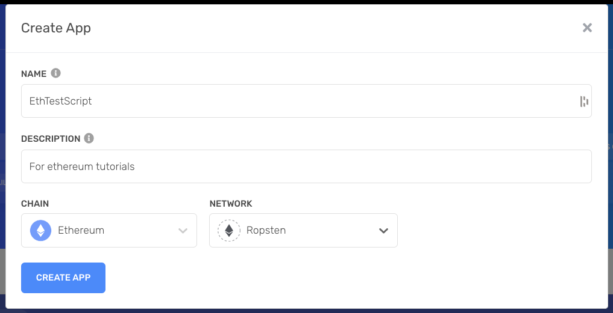
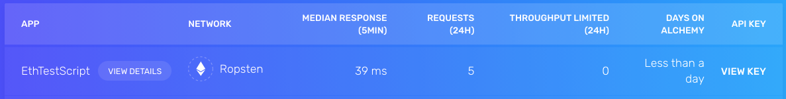

# ethereum-kms-sample

Demo app to sign Ethereum tx with Google Cloud KMS.

## Introduction

This repo is tutorial with example source code on how to use [Google Cloud KMS](https://cloud.google.com/security-key-management) to sign ethereum transactions with [web3.js](https://web3js.readthedocs.io/en/v1.7.1/) and [Ethers.js](https://docs.ethers.io/v5/).

## Prerequisites

1. [Create a Google Cloud project](https://developers.google.com/workspace/guides/create-project), let's call it `my-project`.
2. [Install](https://cloud.google.com/sdk/gcloud) Google Cloud CLI and [login](https://cloud.google.com/sdk/gcloud/reference/auth/login) to your Google Cloud account.
3. Install and configure Git and [Node.js](https://nodejs.org/en/download/).
4. Clone this repo: `git clone git@github.com:Hugoo/ethereum-kms-sample.git && cd ethereum-kms-sample`
5. Create `.env` file: `cp .env.example .env`
6. Install dependencies: `npm i`

# Tutorial

## Create KMS keys

Let's start by creating our key in Google Cloud KMS. To do this, you can either use the `gcloud` CLI or the Google Cloud UI.
We will use the `gcloud` CLI. Please note that you can also [create these keys programmatically](https://cloud.google.com/kms/docs/samples/kms-create-key-asymmetric-sign) with the `@google-cloud/kms` library.

```sh
gcloud config set project my-project
> Updated property [core/project].
```

Create a key ring ([reference](https://cloud.google.com/sdk/gcloud/reference/kms/keyrings/create)):

```sh
gcloud kms keyrings create ethereum-keys --location=us-east1
```

You should see your new key ring in the [Google Cloud Dashboard](https://console.cloud.google.com/security/kms/keyrings).


Then, use [`gcloud kms keys create`](https://cloud.google.com/sdk/gcloud/reference/kms/keys/create) to create a new key:

```sh
gcloud kms keys create key-1 --location=us-east1 --keyring=ethereum-keys --purpose=asymmetric-signing --default-algorithm=ec-sign-secp256k1-sha256 --protection-level=hsm
```


### Purpose

This key will be used to sign our transactions, therefore we should set its purpose to `asymmetric-signing`. You can find more information about the purposes of a key [here](https://cloud.google.com/kms/docs/algorithms#key_purposes).

### Algorithm

According to the [Ethereum Yellow Paper](https://ethereum.github.io/yellowpaper/paper.pdf) Appendix F. Signing Transactions, transactions are signed using recoverable ECDSA signatures. The method uses the `SECP-256k1` curve. Therefore, the algorithm of our key should be `ec-sign-secp256k1-sha256`.

The list of [available algorithms can be found here](https://cloud.google.com/sdk/gcloud/reference/kms/keys/create#--default-algorithm).

Cool, now we have a key ready to be used to sign our transactions :)

## Set up `@google-cloud/kms`

Now that our key is ready, we need to setup our Node.js project so it can use it. Depending on where your application will run, you may need to use a service account. If the application is running within Google Cloud, for instance, in Google App Engine, you can skip using a key and set the permissions directly to the App Engine default service account. For this tutorial, we will focus on running the scripts locally, therefore, we will need to handle the authentication of our script to Google Cloud through a service account.

Create a new service account:

```sh
gcloud iam service-accounts create ethereum-signer \
    --description="ethereum-signer" \
    --display-name="ethereum-signer"

> Created service account [ethereum-signer].
```

Grant the `cloudkms.signerVerifier` role to your service account:

```sh
gcloud projects add-iam-policy-binding my-project \
    --member serviceAccount:ethereum-signer@my-project.iam.gserviceaccount.com --role roles/cloudkms.signerVerifier
```

- `SA_ID`: The ID of your service account. This can either be the service account's email address in the form `SA_NAME`@`PROJECT_ID`.iam.gserviceaccount.com, or the service account's unique numeric ID.

You can check if the service account was created correctly on the [IAM Dashboard](https://console.cloud.google.com/iam-admin/iam):


Finally, you can create a key file for this service account:

```sh
gcloud iam service-accounts keys create ./keys/signer-sa-key.json --iam-account=tx-signer@my-project.iam.gserviceaccount.com
```

You should have a key in `./keys/signer-sa-key.json`.

Finally, let's install the `@google-cloud/kms` lib and verify if everything works

```sh
npm i @google-cloud/kms
```

```sh
npx ts-node src/check-keys.ts
```

```sh
{
  pem: '-----BEGIN PUBLIC KEY-----\n' +
    'MFYwEAYHKoZIzj0CAQYFK4EEAAoDQgAElBNf5/Pw2LHcKxP0DyhUaNRC8UpHOs0w\n' +
    'Ny+/0PSNdBoLrhLxZmeTVSwreMUOjabpM6TMjjBJgXLISOhW3SO0EA==\n' +
    '-----END PUBLIC KEY-----\n',
  algorithm: 'EC_SIGN_SECP256K1_SHA256',
  pemCrc32c: { value: '3112486914' },
  name: 'projects/my-project/locations/us-east1/keyRings/ethereum-keys/cryptoKeys/key-1/cryptoKeyVersions/1',
  protectionLevel: 'HSM'
}
```

From this pem string, we can compute our Ethereum address. For more information, you can check the `./src/check-keys.ts` script and read the article about [Playing with ethereum secp256k1 keys](https://hugomasclet.com/ethereum-secp256k1-keys).

```sh
npx ts-node src/check-keys.ts
```

This script should output the expected Ethereum address associated with your KMS key.

## Alchemy / Ropsten

We will need a RPC access to the Ethereum network, you can get one from [Alchemy](https://alchemy.com/?r=27e4ddf8eccfd874) (this is an affiliate link).



Then grab your API key:



And add this key in your `.env` file for the `ALCHEMY_API_KEY=` variable.

You can also get rETH from a faucet, to fund your account (running the `check-keys.ts` script should give you your Ethereum address).

## Ether.js

With [Ethers.js](https://ethers.io/#!/app-link/welcome.ethers.space/), we can use the [`Signer` API](https://docs.ethers.io/v5/api/signer/) to connect to KMS.

Luckily, there is this super package which lets you use it very easily: <https://github.com/openlawteam/ethers-gcp-kms-signer>.

You can check the code in the `./src/ethersjs.ts` file.

```sh
npx ts-node src/check-keys.ts
```

```js
{
  type: 2,
  chainId: 3,
  nonce: 0,
  maxPriorityFeePerGas: BigNumber { _hex: '0x59682f00', _isBigNumber: true },
  maxFeePerGas: BigNumber { _hex: '0x11210f9eac', _isBigNumber: true },
  gasPrice: null,
  gasLimit: BigNumber { _hex: '0x5208', _isBigNumber: true },
  to: '0xE94E130546485b928C9C9b9A5e69EB787172952e',
  value: BigNumber { _hex: '0x038d7ea4c68000', _isBigNumber: true },
  data: '0x',
  accessList: [],
  hash: '0xda045876596e832703b131cfc5991a18617a0685dcdbd571da52273c6e481fbc',
  v: 0,
  r: '0x49c68f3df02aeb31d00b3326446973f0453c76cb7afc6ff8c78f7c00f928e8da',
  s: '0x522df0a097fc6452e75995c606b8de5793a7b9d1623d35753b113317fc6ca1fa',
  from: '0x19a7930683619396d06bdA6Ce43dc7A8659E7C20',
  confirmations: 0,
  wait: [Function (anonymous)]
}
```

## web3.js - WIP

To use KMS with Web3js, we can either:

- Create a provider
- Create an account

The account should have this interface:

```ts
export interface Account {
  address: string;
  privateKey: string;
  signTransaction: (
    transactionConfig: TransactionConfig,
    callback?: (signTransaction: SignedTransaction) => void,
  ) => Promise<SignedTransaction>;
  sign: (data: string) => Sign;
  encrypt: (password: string) => EncryptedKeystoreV3Json;
}
```

# References

- <https://github.com/odanado/aws-kms-provider#examples>
